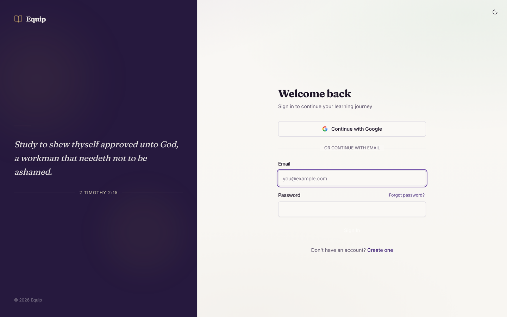
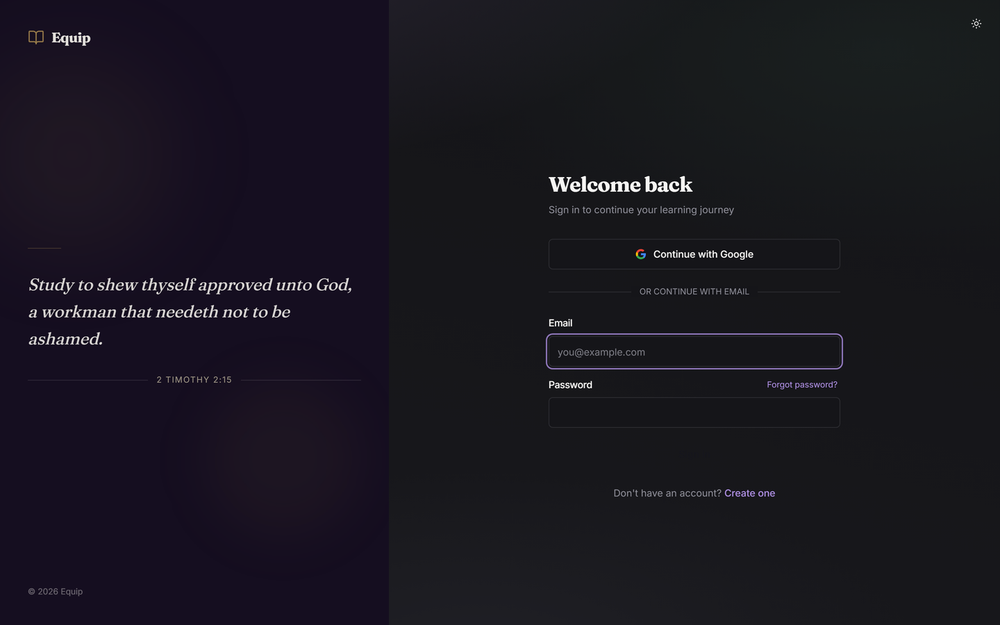
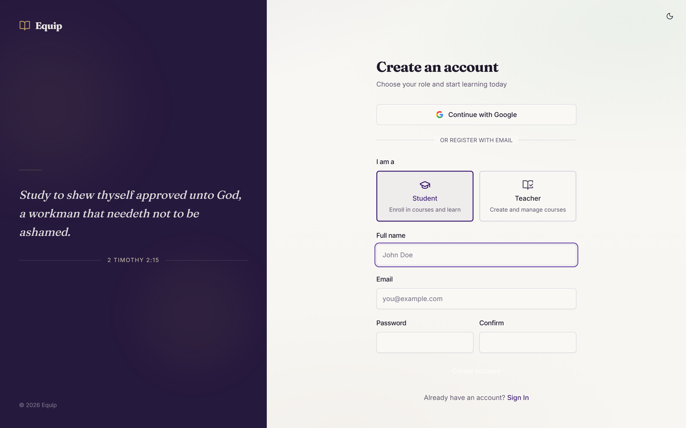
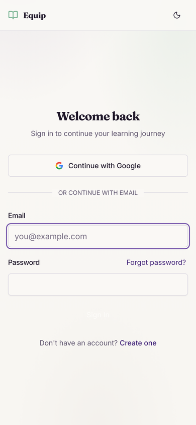

<p align="center">
  
</p>

<h1 align="center">Equip</h1>

<p align="center">
  A free, open-source learning management system built for Bible schools,
  church ministries, and nonprofit educational programs.
</p>

<p align="center">
  <a href="https://github.com/ArVaViT/equip/blob/main/LICENSE">
    
  </a>
  <a href="https://github.com/ArVaViT/equip/actions/workflows/backend-ci.yml">
    
  </a>
  <a href="https://github.com/ArVaViT/equip/actions/workflows/frontend-ci.yml">
    
  </a>
  <a href="https://github.com/ArVaViT/equip/issues?q=is%3Aissue+is%3Aopen+label%3A%22good+first+issue%22">
    
  </a>
</p>

<p align="center">
  <a href="https://equipbible.com">Live demo</a> &middot;
  <a href="ROADMAP.md">Roadmap</a> &middot;
  <a href="CONTRIBUTING.md">Contributing</a> &middot;
  <a href="CHANGELOG.md">Changelog</a>
</p>

---

## Screenshots

<table>
  <tr>
    <td width="50%" align="center">
      
      <br /><sub>Sign in (light)</sub>
    </td>
    <td width="50%" align="center">
      
      <br /><sub>Sign in (dark)</sub>
    </td>
  </tr>
  <tr>
    <td width="50%" align="center">
      
      <br /><sub>Account creation — student / teacher role picker</sub>
    </td>
    <td width="50%" align="center">
      
      <br /><sub>Mobile (390px)</sub>
    </td>
  </tr>
</table>

> Live at [equipbible.com](https://equipbible.com). Teacher and admin views (gradebook, course editor, analytics) are behind sign-in &mdash; create a free account to explore.

---

## Why this project?

Hundreds of small Bible schools, home churches, and missionary training
programs around the world still manage courses on paper, WhatsApp, or
spreadsheets. Commercial LMS platforms are expensive, overkill, or require
technical expertise that volunteer-run organizations simply don't have.

**Equip** is designed to change that:

- **Free forever** — MIT-licensed, no paywalls, no "premium" tiers.
- **Simple to deploy** — one-click Vercel deploy with a free Supabase
  database. No Docker, no servers to manage.
- **Built for small scale** — optimized for 20-100 students, not enterprise
  pricing models.
- **Contributor-friendly** — clear docs, conventional commits, issue
  templates, and a welcoming community.

---

## Features

| Area | What you get |
|------|-------------|
| **Course authoring** | Courses, modules, chapters, rich content blocks (TipTap editor with images, YouTube, callouts, audio) |
| **Assessments** | Multiple-choice, true/false, short-answer, and essay quizzes with attempt limits and teacher grading |
| **Assignments** | Student submissions, grading queue, automatic chapter completion |
| **Progress tracking** | Per-chapter progress, module/course completion, enrollment management |
| **Certificates** | Auto-generated certificates with teacher approval flow |
| **Teacher tools** | Gradebook, analytics dashboard, cohort management, calendar, announcements |
| **Admin tools** | User management, bulk operations, CSV export, course cloning, soft delete |
| **Design** | Editorial aesthetic, dark/light theme, responsive (360px+), OKLCH semantic tokens |
| **Bilingual content (RU↔EN)** | Auto-translation of all teacher-authored text via Gemini, cached per (entity, field, locale); canonical KJV / Synodal substitution for Bible quotes; symmetric — author writes in their language, students read in theirs |
| **Security** | RLS on every table, server-side HTML sanitization, CORS lockdown, audit pipeline |

---

## Tech stack

| Layer | Technology |
|-------|-----------|
| Frontend | React 18, TypeScript, Vite, Tailwind CSS, shadcn/ui, TipTap, Radix |
| Backend | Python 3.12, FastAPI, SQLAlchemy 2, Pydantic 2 |
| Database | PostgreSQL (Supabase) with Row Level Security |
| Auth | Supabase Auth (Google OAuth + email/password) |
| Storage | Supabase Storage (avatars, course assets, materials) |
| Deploy | Vercel (static frontend + Python serverless backend) |
| CI/CD | GitHub Actions (lint, typecheck, test, audit) + Dependabot |

---

## Quick start

### Prerequisites

- **Node.js** 22.x (`.nvmrc` pins 22.18.0), **npm** >= 10
- **Python** 3.12
- A free [Supabase](https://supabase.com) project (or just run backend
  tests with SQLite — no Supabase needed)

### 1. Clone and install

```bash
git clone https://github.com/<your-username>/equip.git
cd equip

# Frontend
cd frontend && npm ci && cd ..

# Backend
cd backend && pip install -r requirements.txt && cd ..
```

### 2. Configure environment

```bash
cp frontend/.env.example frontend/.env.local   # fill in VITE_* vars
cp backend/.env.example  backend/.env           # fill in Supabase creds
```

See each `.env.example` for a description of every variable.

### 3. Start development

```bash
# Terminal 1 — API
cd backend && uvicorn app.main:app --reload     # http://localhost:8000

# Terminal 2 — SPA
cd frontend && npm run dev                      # http://localhost:5173
```

### 4. Run tests

```bash
cd backend  && python -m pytest tests/    # 540+ tests (SQLite in-memory)
cd frontend && npm run test:run           # Vitest + jsdom
cd frontend && npm run i18n:check         # bilingual locale parity (en.json ↔ ru.json)
```

---

## Project structure

```
backend/            Python FastAPI application
  app/
    api/v1/         Route modules
    core/           Config, database, auth helpers
    models/         SQLAlchemy ORM models
    schemas/        Pydantic request/response schemas
    services/       Business logic
  tests/            pytest suite

frontend/           React SPA (Vite + TypeScript)
  src/
    components/     UI components (shadcn/ui + custom)
    pages/          Route-level pages
    services/       API client + Supabase helpers
    context/        React contexts (auth, theme)

supabase/
  migrations/       SQL migration files (production schema source of truth)

.github/
  workflows/        CI pipelines
  ISSUE_TEMPLATE/   Bug report and feature request forms
```

---

## Contributing

We welcome contributions of all sizes — from typo fixes to new features.

1. Read [CONTRIBUTING.md](CONTRIBUTING.md) for setup and workflow details.
2. Check [open issues](https://github.com/ArVaViT/equip/issues)
   — look for the `good first issue` label if you're new.
3. See the [ROADMAP](ROADMAP.md) for bigger-picture direction.

**We especially welcome:**
- Nonprofit Bible schools sharing their real-world needs
- Designers improving the student/teacher experience
- Translators reviewing and refining the AI-translated content (the platform is already RU↔EN bilingual; human review of the canonical Bible-school terminology is what would push quality from "good" to "great")
- QA testers finding and reporting bugs

---

## For nonprofits

If you're a Bible school, ministry, or educational nonprofit considering
this platform:

- **It's free.** MIT license means you can use, modify, and deploy it with
  zero cost.
- **No vendor lock-in.** Host it yourself or use the free tiers of Vercel +
  Supabase.
- **You don't need a developer on staff.** Follow the quick start above, or
  open a [discussion](https://github.com/ArVaViT/equip/discussions)
  and the community will help.
- **Your feedback shapes the product.** Open a feature request — the roadmap
  is driven by real ministry needs.

---

## How Equip compares

There are great LMS options out there. Equip exists in a specific gap they don't fill well: a small Bible school or ministry that wants something modern, free, and Bible-aware without standing up a full LAMP server or paying per student.

| | **Equip** | **Moodle** | **Google Classroom** | **Canvas LMS** |
|---|---|---|---|---|
| License / cost | MIT, free | GPL, free | Free | Per-user fees |
| Self-hosted | One-click Vercel + Supabase free tier | LAMP server you maintain | SaaS only | SaaS only |
| Setup effort | Minutes | Hours to days | None | None |
| UI | Modern, theme-aware (light + dark) | Functional, dated | Modern | Modern |
| Scripture handling | KJV / Synodal substitution, paraphrase guard | None | None | None |
| Bilingual content | Auto RU&harr;EN via Gemini, cached | Manual i18n | None | Manual i18n |
| Code customization | TypeScript + Python | PHP plugins | Closed source | Closed source |
| Best fit | Small ministries, 20&ndash;100 students | Universities, 1000+ students | K&ndash;12 in Google Workspace | Enterprise with budget |

**Pick Moodle** if you have IT staff and need every feature ever shipped. **Pick Canvas** if budget isn't a constraint. **Pick Google Classroom** if your students already live in Google Workspace and you don't need certificates or real assessments. **Pick Equip** if you want a small, modern, scripture-aware platform you can deploy in an afternoon.

---

## Documentation

| Audience | Document |
|----------|----------|
| Contributors | [CONTRIBUTING.md](CONTRIBUTING.md) — setup, workflow, conventions |
| Designers / UI work | [docs/DESIGN.md](docs/DESIGN.md) — aesthetic, tokens, motion, banned patterns |
| Component reuse | [docs/COMPONENTS.md](docs/COMPONENTS.md) — the patterns library (`<Badge>`, `<StatCard>`, `<EmptyState>`, …) |
| Translators / i18n work | [docs/I18N.md](docs/I18N.md) — bilingual workflow, locale files, key parity |
| Architecture | [docs/adr/](docs/adr/) — Architecture Decision Records |
| Cross-cutting UI calls | [docs/UI-DECISIONS.md](docs/UI-DECISIONS.md) — frozen UI decisions log |
| Security disclosure | [SECURITY.md](SECURITY.md) |

## Community

- [GitHub Discussions](https://github.com/ArVaViT/equip/discussions) — questions, ideas, show & tell
- [Issue tracker](https://github.com/ArVaViT/equip/issues) — bug reports and feature requests
- [Changelog](CHANGELOG.md) — what's new in each release
- [Security policy](SECURITY.md) — how to report vulnerabilities

---

## License

[MIT](LICENSE) — free for personal, educational, and commercial use.
