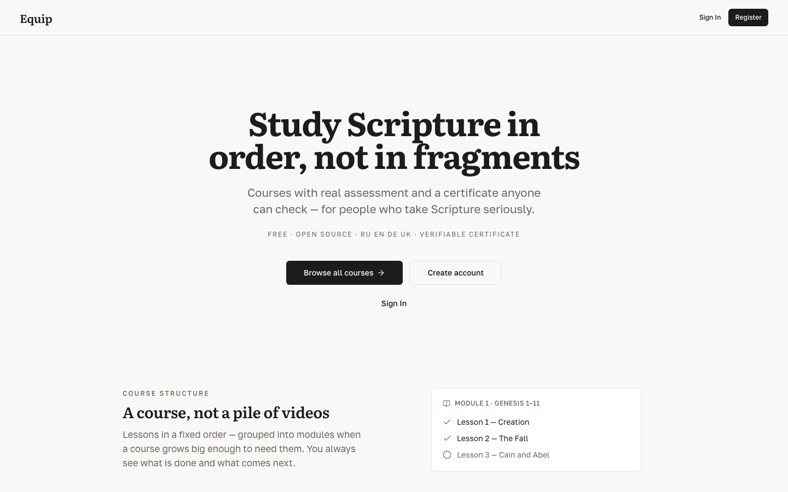
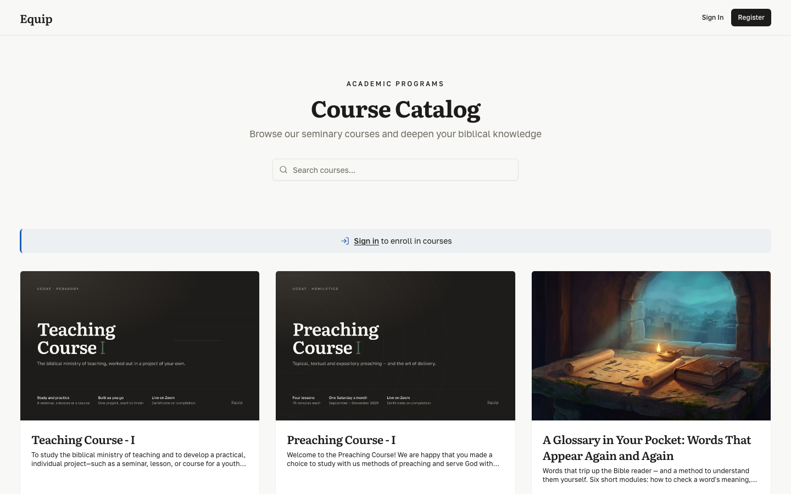
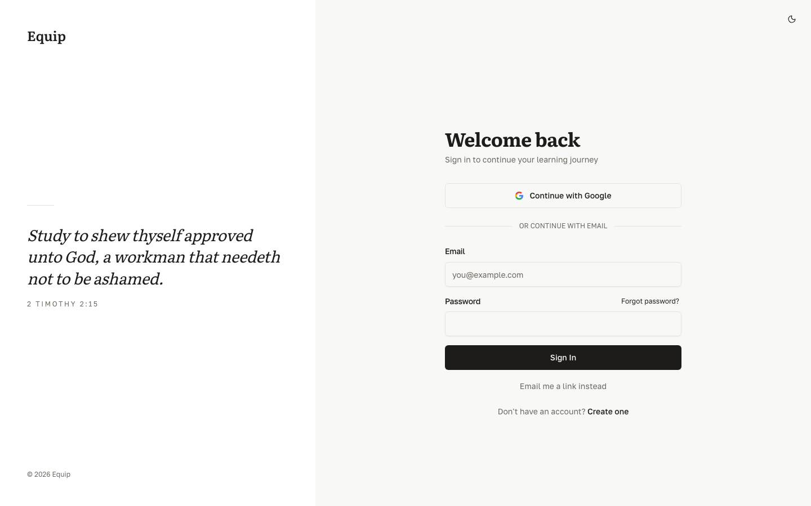
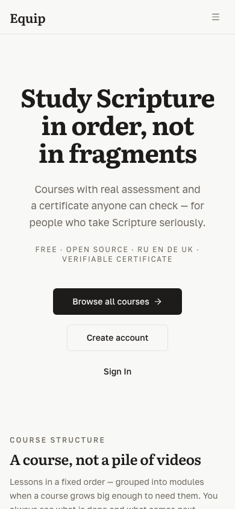

<p align="center">
  
</p>

<h1 align="center">Equip</h1>

<p align="center">
  A free, open-source learning management system built for Bible schools,
  church ministries, and nonprofit educational programs.
</p>

<p align="center">
  <a href="https://github.com/ArVaViT/equip/blob/main/LICENSE">
    
  </a>
  <a href="https://github.com/ArVaViT/equip/actions/workflows/backend-ci.yml">
    
  </a>
  <a href="https://github.com/ArVaViT/equip/actions/workflows/frontend-ci.yml">
    
  </a>
  <a href="https://app.codecov.io/gh/ArVaViT/equip">
    
  </a>
  <a href="https://scorecard.dev/viewer/?uri=github.com/ArVaViT/equip">
    
  </a>
</p>

<p align="center">
  <a href="https://equipbible.com">Live site</a> &middot;
  <a href="#documentation">Documentation</a> &middot;
  <a href="SECURITY.md">Security</a>
</p>

---

## Screenshots

<table>
  <tr>
    <td width="50%" align="center">
      
      <br /><sub>Home</sub>
    </td>
    <td width="50%" align="center">
      
      <br /><sub>Course catalog — open to visitors; enrolling needs an account</sub>
    </td>
  </tr>
  <tr>
    <td width="50%" align="center">
      
      <br /><sub>Sign in — Google, email and password, or a sign-in link</sub>
    </td>
    <td width="50%" align="center">
      
      <br /><sub>Mobile (390px)</sub>
    </td>
  </tr>
</table>

> Live at [equipbible.com](https://equipbible.com). Course pages, the lesson reader, and the teacher and director views (course editor, gradebook, analytics) are behind sign-in. Anyone can create a free student account; teachers join a school by invitation.

---

## Why this project?

Hundreds of small Bible schools, home churches, and missionary training
programs around the world still manage courses on paper, WhatsApp, or
spreadsheets. Commercial LMS platforms are expensive, overkill, or require
technical expertise that volunteer-run organizations simply don't have.

**Equip** is designed to change that:

- **Free forever** — MIT-licensed, no paywalls, no "premium" tiers.
- **Serverless hosting** — a Vercel frontend and backend on a Supabase
  project. No Docker, no servers to manage.
- **Built for small scale** — optimized for 20-100 students, not enterprise
  pricing models.
- **Multilingual out of the box** — a teacher writes in one language and
  students read in theirs; Russian, English, German, and Ukrainian.

---

## Features

| Area | What you get |
|------|-------------|
| **Course authoring** | Courses, modules, chapters, rich content blocks (TipTap editor with images, YouTube, callouts, audio) |
| **Assessments** | Multiple-choice, true/false, short-answer, and essay quizzes with attempt limits and teacher grading |
| **Assignments** | Student submissions, grading queue, automatic chapter completion |
| **Progress tracking** | Per-chapter progress, module/course completion, enrollment management |
| **Certificates** | Auto-generated certificates with teacher approval flow |
| **Teacher tools** | Gradebook with CSV export, analytics dashboard, calendar, announcements |
| **Schools (organizations)** | Platform staff admit a school and appoint its director; the director runs cohorts and invites teachers into the school, and a teacher invites students onto their own course. Self-signup only ever creates a student account |
| **Admin tools** | User management, bulk role changes, course cloning, soft delete and restore |
| **Design** | Editorial aesthetic, dark/light theme, responsive (360px+), HSL semantic tokens |
| **Multilingual content (RU / EN / DE / UK)** | Auto-translation of all teacher-authored text via Gemini, stored per (entity, field, locale) in the `content_versions` table; canonical Scripture substituted from the published edition of each language rather than paraphrased by the model; symmetric — an author writes in their language, students read in theirs; every translation is checked against its source before a reader sees it, and a course enters the catalogue only when all four languages are in place; off-the-request-path via a cron-driven worker queue so publishing stays instant even on 100-block courses |
| **Security** | RLS on every table, server-side HTML sanitization, CORS lockdown, audit pipeline, typed error envelope (`{code, message, context}`) for structured client handling and Datadog error tracking |

---

## Tech stack

| Layer | Technology |
|-------|-----------|
| Frontend | React 18, TypeScript, Vite, Tailwind CSS, shadcn/ui, TipTap, Radix |
| Backend | Python 3.12, FastAPI, SQLAlchemy 2, Pydantic 2 |
| Database | PostgreSQL (Supabase) with Row Level Security |
| Auth | Supabase Auth (Google OAuth, email/password, sign-in link) |
| Storage | Supabase Storage (avatars, course assets, materials) |
| Deploy | Vercel (static frontend + Python serverless backend) |
| CI/CD | GitHub Actions (lint, typecheck, test, audit) + Dependabot |

---

## Quick start

### Prerequisites

- **Node.js** 22.x (`.nvmrc` pins 22.18.0), **npm** >= 10
- **Python** 3.12
- A free [Supabase](https://supabase.com) project (or just run backend
  tests with SQLite — no Supabase needed)

### 1. Clone and install

```bash
git clone https://github.com/<your-username>/equip.git
cd equip

# Frontend
cd frontend && npm ci && cd ..

# Backend
cd backend && pip install -r requirements.txt && cd ..
```

### 2. Configure environment

```bash
cp frontend/.env.example frontend/.env.local   # fill in VITE_* vars
cp backend/.env.example  backend/.env           # fill in Supabase creds
```

See each `.env.example` for a description of every variable.

### 3. Start development

```bash
# Terminal 1 — API
cd backend && uvicorn app.main:app --reload     # http://localhost:8000

# Terminal 2 — SPA
cd frontend && npm run dev                      # http://localhost:5173
```

### 4. Run tests

```bash
cd backend  && python -m pytest tests/    # 4000+ tests (SQLite in-memory)
cd frontend && npm run test:run           # Vitest + jsdom
cd frontend && npm run i18n:check         # locale parity across ru / en / de / uk
```

---

## Project structure

```
backend/            Python FastAPI application
  app/
    api/v1/         Route modules
    core/           Config, database, auth helpers
    models/         SQLAlchemy ORM models
    schemas/        Pydantic request/response schemas
    services/       Business logic
  tests/            pytest suite

frontend/           React SPA (Vite + TypeScript)
  src/
    components/     UI components (shadcn/ui + custom)
    pages/          Route-level pages
    services/       API client + Supabase helpers
    context/        React contexts (auth, theme)

supabase/
  migrations/       SQL migration files (production schema source of truth)

.github/
  workflows/        CI pipelines
```

---

## Contributing

The source is open under the MIT license and the issue tracker is open, but
this is a single-maintainer project with no contribution process to speak
of: no review rotation, no triage promises, no roadmap to sign up against.
Fork it freely. If you run a Bible school and something here is close to
what you need, an issue describing the gap is more useful than a patch.

---

## For nonprofits

If you're a Bible school, ministry, or educational nonprofit considering
this platform:

- **It's free.** The MIT license means you can use, modify, and deploy it
  with no license fee; you pay only for whatever hosting you choose.
- **No vendor lock-in.** The code, the schema (`supabase/migrations/`), and
  your data are yours to move.
- **Hosting it yourself takes someone comfortable with a terminal.** The
  quick start above and [docs/DEPLOYMENT.md](docs/DEPLOYMENT.md) cover the
  steps (two Vercel projects, a Supabase project, migrations, env vars).
  The per-minute translation cron needs a paid Vercel plan.
- **Your feedback shapes the product.** Open an issue describing what your
  school actually needs — that is what the work gets pointed at.

---

## How Equip compares

There are great LMS options out there. Equip exists in a specific gap they don't fill well: a small Bible school or ministry that wants something modern, free, and Bible-aware without standing up a full LAMP server or paying per student.

| | **Equip** | **Moodle** | **Google Classroom** | **Canvas LMS** |
|---|---|---|---|---|
| License / cost | MIT, free | GPL, free | Free | Per-user fees |
| Self-hosted | Vercel + Supabase | LAMP server you maintain | SaaS only | SaaS only |
| Setup effort | An afternoon | Hours to days | None | None |
| UI | Modern, theme-aware (light + dark) | Functional, dated | Modern | Modern |
| Scripture handling | The published edition of each language, paraphrase guard | None | None | None |
| Multilingual content | Four languages, machine-translated and validated | Manual i18n | None | Manual i18n |
| Code customization | TypeScript + Python | PHP plugins | Closed source | Closed source |
| Best fit | Small ministries, 20&ndash;100 students | Universities, 1000+ students | K&ndash;12 in Google Workspace | Enterprise with budget |

**Pick Moodle** if you have IT staff and need every feature ever shipped. **Pick Canvas** if budget isn't a constraint. **Pick Google Classroom** if your students already live in Google Workspace and you don't need certificates or real assessments. **Pick Equip** if you want a small, modern, scripture-aware platform you can deploy in an afternoon.

---

## Documentation

| Audience | Document |
|----------|----------|
| Designers / UI work | [docs/DESIGN.md](docs/DESIGN.md) — aesthetic, tokens, motion, banned patterns |
| Component reuse | [docs/COMPONENTS.md](docs/COMPONENTS.md) — the patterns library (`<Badge>`, `<StatCard>`, `<EmptyState>`, …) |
| Translators / i18n work | [docs/I18N.md](docs/I18N.md) — locale files, key parity, plural categories |
| Architecture | [docs/adr/](docs/adr/) — Architecture Decision Records |
| Cross-cutting UI calls | [docs/UI-DECISIONS.md](docs/UI-DECISIONS.md) — frozen UI decisions log |
| Shipping a change | [docs/DEPLOYMENT.md](docs/DEPLOYMENT.md) — what deploys when, the two manual steps (migrations, edge function), env vars, rollback |
| Authenticated e2e in CI | [docs/E2E.md](docs/E2E.md) — the local Supabase-CLI stack `frontend-e2e.yml` boots per run |
| Running in production | [docs/OBSERVABILITY.md](docs/OBSERVABILITY.md) — monitoring, log forwarding, incident debugging |
| Backup and restore | [docs/runbooks/backup-restore.md](docs/runbooks/backup-restore.md) |
| Security model | [docs/SECURITY.md](docs/SECURITY.md) — RLS, audit log, secrets, what is backend-gated |
| Dashboards / metrics | [docs/datadog/](docs/datadog/) — Datadog dashboard + monitor JSON specs |
| Security disclosure | [SECURITY.md](SECURITY.md) |

## License

[MIT](LICENSE) — free for personal, educational, and commercial use.
